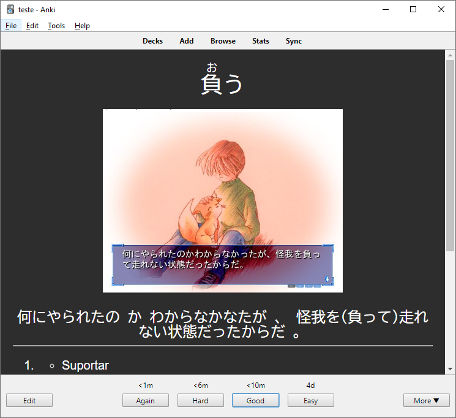
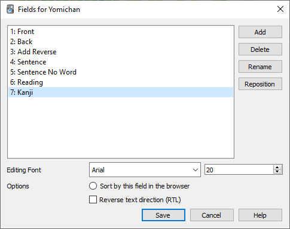
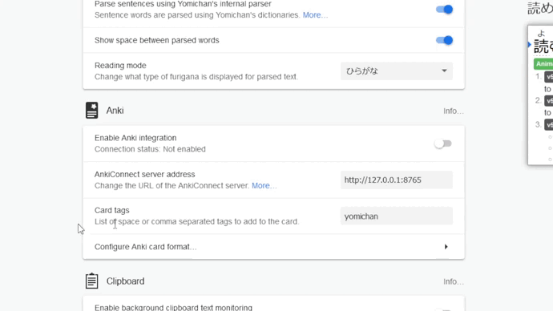
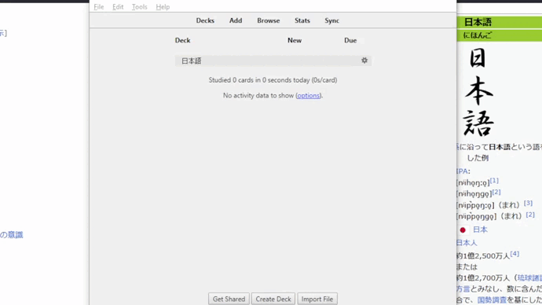
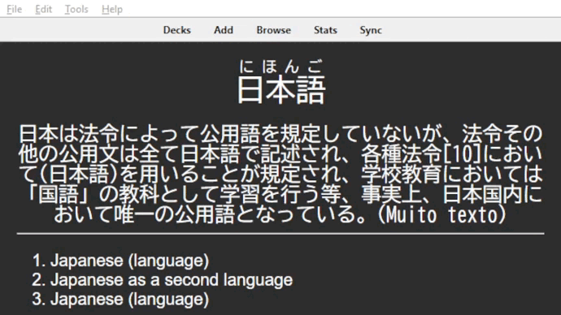

## Utilidade
 
Um termo em inglês comum que se usa para dizer que você está acumulando vocabulário é *mining*, porque é literalmente um processo no qual você vai minerando palavras novas. Para essas novas palavras "mineradas", você teria que memorizá-las para poder usar depois. E é aí que entra o Anki, um programa código aberto, utilizando uma técnica de memorização espaçada, em que você cria cards onde pode armazenar as palavras novas aprendidas, e irá revisá-las ao longo do tempo. Assim, evita o esquecimento.
 
Para continuar o tutorial, instale o [Anki](https://apps.ankiweb.net/).
 
## Customização
 
#### Extensões
 
O Anki permite você instalar vários plugins e customizar o design do jeito que quiser, facilitando muito mais as formas de aprender. Neste guia, irei mostrar uma forma de configurar o Anki de uma forma bem versátil. Então, é esperado que você instale essas extensões. Para isso, apenas pressione as teclas ++ctrl+shift+a++ e coloque os códigos seguintes:
 
| Código da extensão      | Funcionalidade                       |
| ----------- | ------------------------------------ |      
| [2055492159](https://ankiweb.net/shared/info/2055492159)   | Permitira sincronia com Yomichan(Veja o tópico de integração com yomichan)  |
| [1771074083](https://ankiweb.net/shared/info/1771074083)   | Permitira você acompanhar e rever seu progresso ao longo do ano     | :material-check-all: Update resource |
| [1020366288](https://ankiweb.net/shared/info/1020366288)   | Permitira você editar os cartões na mesma tela de revisão, apenas pressione ++ctrl++ e clique com o botão esquerdo do mouse  | :material-close:     Delete resource |
 
 
#### Fields
 
Selecione o idioma do seu anki:
 
=== "Inglês"
 
    1. Abra seu anki e pressione ++ctrl+shift+n++
    1. Clique em `Add` e selecione `Clone: Basic (optional reversed card)`
    1. Renomeie para Yomichan
    1. Selecione o mesmo e clique em ``Fields...``
    1. Agora clique em ``Add`` e adicione mais 4 *fields*:
        - Sentence
        - Sentence No Word
        - Reading
        - Kanji
 
    
    !!! info "Informação"
        Você pode colocar qualquer nome desde que lembre-se depois.
 
 
    6. Clique em ``Save`` e depois feche a janela.
 
 
=== "Português"
 
    1. Abra seu anki e pressione ++ctrl+shift+n++
    1. Clique em `Adicionar` e selecione `Clone: Basic (optional reversed card)`
    1. Renomeie para Yomichan
    1. Selecione o mesmo e clique em ``Campos...``
    1. Agora clique em ``Adicionar`` e adicione mais 4 *fields*:
        - Sentence
        - Sentence No Word
        - Reading
        - Kanji
 
    
    !!! info "Informação"
        Você pode colocar qualquer nome desde que lembre-se depois.
 
 
    6. Clique em ``Save`` e depois feche a janela.
 
#### Cards
=== "Inglês"
 
    1. Pressione ++ctrl+shift+n++ novamente, selecione `Yomichan` e clique em `Cards...`
    1. Em ``Front Template`` apague o conteúdo e cole o código abaixo:
        ```css
        <div style='font-family: BIZ UDGothic; font-size: 36px;'>{{edit:Front}}</div>
        <br> <div style='font-family: BIZ UDGothic; font-size: 24px;'>{{edit:Sentence}}</div>
        ```
    1. Depois em `Back Template`  apague o conteúdo antigo e cole o código abaixo:
        ```css
        <div style='font-family: BIZ UDGothic; font-size: 36px;'>{{edit:Reading}}</div>
 
        <br>
        <div style='font-family: BIZ UDGothic; font-size: 24px;'>{{edit:Sentence}}</div>
 
        <hr id=answer>
        {{edit:Back}}
        <br>
        <div style='font-family: BIZ UDGothic; font-size: 24px;'>{{edit:Kanji}}</div>
        ```
    1. E por último em ``Styling``, apague o conteúdo e reescreva com o código abaixo:
            ```css
            .card {
 
                font-family: arial;
                font-size: 20px;
                text-align: center;
                color: #ffffff;
                background-color: #2d2d2d;
            }

            img {
                max-height: 300px;
            }
            ```
 
 
=== "Português"
 
    1. Pressione ++ctrl+shift+n++ novamente e clique em `Cartões...`
    1. Em ``Modelo da Frente`` apague o conteúdo e cole o código abaixo:
        ```css
        <div style='font-family: BIZ UDGothic; font-size: 36px;'>{{edit:Front}}</div>
        <br> <div style='font-family: BIZ UDGothic; font-size: 24px;'>{{edit:Sentence}}</div>
        ```
    1. Depois em `Modelo do Verso`  apague o conteúdo antigo e cole o código abaixo:
        ```css
        <div style='font-family: BIZ UDGothic; font-size: 36px;'>{{edit:Reading}}</div>
 
        <br>
        <div style='font-family: BIZ UDGothic; font-size: 24px;'>{{edit:Sentence}}</div>
 
        <hr id=answer>
        {{edit:Back}}
        <br>
        <div style='font-family: BIZ UDGothic; font-size: 24px;'>{{edit:Kanji}}</div>
        ```
    1. E por último em ``Estilo``, apague o conteúdo e reescreva com o código abaixo:
            ```css
            .card {
 
            font-family: arial;
            font-size: 20px;
            text-align: center;
            color: #ffffff;
            background-color: #2d2d2d;
              }
            ```
 
 
## Sincronização com Yomichan
 
Como fazer os cards manualmente toma bastante tempo, se sincronizarmos o Anki e o Yomichan juntos, podemos então apenas apertar shift em uma palavra que não sabemos, e em seguida clicar em um + que nosso card já estará pronto automaticamente.
 
1. Crie um deck primeiramente no anki, por exemplo: 日本語
1. Vá nas configurações do Yomichan, clique para habilitar a integração com o Anki e selecione o Deck que você criou e o Modelo(no meu caso, 日本語 e yomichan respectivamente). 
1. Após isso, preencha os `value` da seguinte forma:
    - Front: ``{expression}``
    - Back: ``{glossary-brief}``
    - Add Reverse: (Deixe em branco)
    - Sentence: ``{cloze-prefix}({cloze-body}){cloze-suffix}``
    - Sentence No Word: ``{cloze-prefix}（・・・）{cloze-suffix}``
    - Screenshot: (Deixe em branco)
    - Reading: ``{furigana}``
    - Kanji: (Deixe em branco)
 
Pronto! Agora tudo está funcionando como o vídeo abaixo: 
 
## Dúvidas e dicas
 
??? question "Como editar os textos?"
    Muitas das vezes, os cards gerados ficam bem grandes. Caso queira editar isso, apenas pressione ++ctrl++ no card e modifique do seu jeito tanto a pergunta quanto a resposta. 
 
??? question "Quantas palavras por dia adicionar?"
    No começo, talvez umas 5. Ao longo do tempo você vai se acostumando e deve chegar em umas 20 palavras por dia(minha média fica entre 15 e 20).
   
    Não é recomendável adicionar muitas palavras pois você terá que revisa-las depois, já que vai tomar bastante tempo seu.(O ideal seria você gastar mais tempo lendo em japonês do que revisando palavras no Anki)
 
??? question "Quando devo adicionar uma palavra nova no deck?"
    Quando você achar que a palavra vai ser útil para você no futuro, ou seja, seu principal requisito será a frequência da palavra. Por isso os dicionários de frequência ajudam a decidir se uma palavra vai ou não pro deck.
 
    Se uma palavra difícil estiver aparecendo com frequência na sua leitura, também é interessante adicioná-la(apesar que se a palavra estiver aparecendo muito, você possivelmente já deveria ter memorizado)

??? question "Como devo revisar?"
    O anki vem com 4 opções para dizer sua confiança sobre um card(Novamente, Difícil, Bom, Fácil). Eu recomendo apenas usar o *Novamente* caso não lembre-se e o *Bom* caso lembre-se da palavra.
 
??? question "Como adicionar uma imagem?"
    Use um programa como [ShareX](https://getsharex.com/) ou um outro que forneça clipboard, tire a print da imagem e depois dê um ++ctrl+v++ na sentença.
 


   
 

