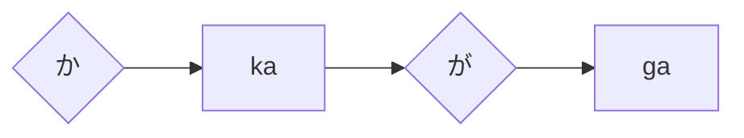
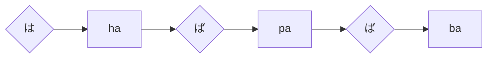
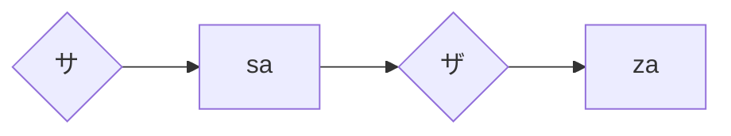
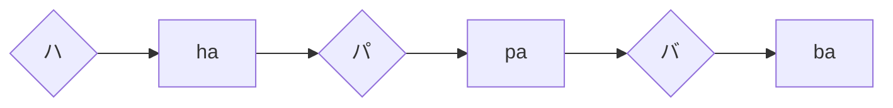
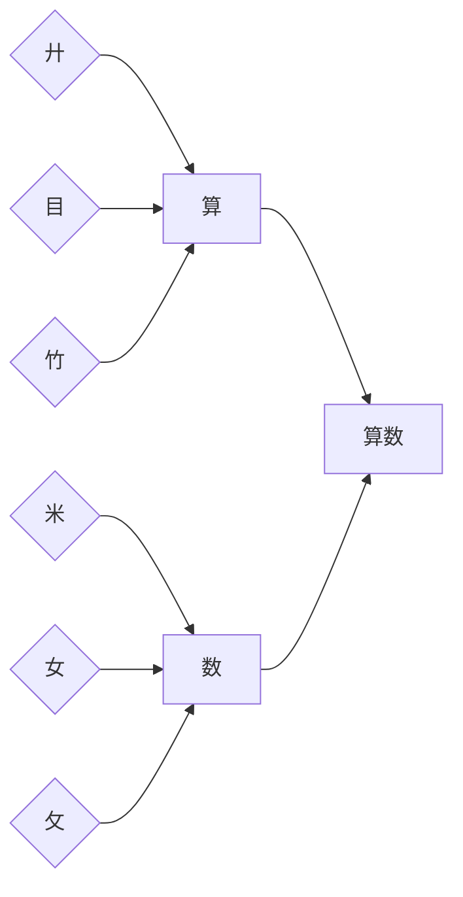
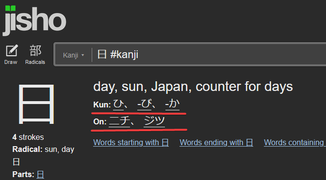
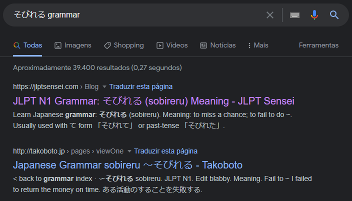

# Prefácio

Como já explicado anteriormente, o japonês tem 3 alfabetos(hiragana, katakana e kanji), porém você deve estar se perguntando como é usado em textos normais. Pois bem da seguinte forma:

Símbolos em vermelho -> Hiragana

Símbolos em azul -> Katakana

Símbolos em verde -> Kanji

## Kana

Kana é referente ao Hiragana e Katakana que são dois sistemas silábicos do japonês, no qual cada símbolo tem algum som (ao todo, são 46 Hiragana e 50 Katakana). 

Além disso, há uma leve variação no som dos kanas se acrescentar um traço ou uma bolinha (tipo os acentos da nossa língua). Veja o exemplo abaixo para entender melhor:

- ^^Hiragana^^

- ^^Katakana^^

Você verá bastante o uso de hiraganas em palavras, conjugações de verbo, leitura de kanji como [furiganas](https://pt.wikipedia.org/wiki/Furigana) e assim por diante. Já os katakanas são comuns em palavras estrangeiras, gírias ou onomatopeias. Porém não existe regra que impeça o seu uso para palavras normais da língua, só não é comum. 

Um método simples de memorizar todos os katakanas e hiraganas é o uso de sites de memorização rápida tipo flashcard. Se você treinar uns 30 minutos ao longo do dia, entre uma ou duas semanas você possivelmente terá decorado todos os kanas.

!!! note "Sites para memorizar os kanas"

    [Kana pro](https://kana.pro/): Um excelente site, devido a opção de marcar justamente o que pretende memorizar caso não lembre bem de um conjunto de katakanas ou hiraganas.  

    [DJT kana](https://djtguide.neocities.org/kana/index.html): Parecido com o Kana pro, só que com um layout diferente.

## Kanji

#### Utilidade

Kanji são os demais caracteres da língua japonesa adotados do chinês(mas com suas modificações na escrita) como 日, 政, 磯. No qual um ou a combinação entre eles(ou entre hiraganas e  raros casos o katakana) podem finalmente formar as palavras. 

Como observaram, alguns kanjis têm traços muito mais complexos do que os kanas. A utilidade disso é para se diferenciar o mesmo som de palavras diferente(antônimos), por exemplo: O som kami pode significar **papel, deus, cabelo e tempero**. Então se estivesse escrito somente em hiragana como かみ, ficaria difícil dizer qual かみ está se referindo. Agora com o kanji, podemos escrever 紙(papel), 神(deus), 髪(cabelo) ou 加味(tempero).

#### Significados

Os kanjis separados podem possuir significados próximos, por exemplo, algumas palavras que usam o kanji 学 estão relacionadas a aprendizagem, por exemplo: 学校(escola), 大学(univeridade), 数学(matemática). *Vale lembrar que tem casos no qual os significados dos kanjis juntos formam uma palavra nada a ver*.

Algo que ajuda bastante, é que a maioria dos kanjis mais complexos são derivados de outros kanjis mais simples, como o diagrama abaixo: 

Graças a isso, você conseguirá deduzir o significado de algumas palavras(apesar que sempre é bom conferir no dicionário) e terá mais facilidade para memorizá-las também.

Então, você tem duas opções para estudar os kanjis. A primeira é aprendê-los ^^separadamente^^ como o diagrama acima. A principal vantagem disso é que para novos vocabulários, você terá uma tendência de memorizá-los mais rapidamente. Porém, isso pode tornar o estudo muito mais cansativo, já que você gastará bem mais tempo tendo que decorar mais de 3000 kanjis. Já o segundo método é aprender com palavras, ou seja, quando você vê algo como 音楽家(músico), em vez de decorar 音, 楽, 家 separadamente, você decora a palavra inteira, o que pode ser bem mais simples caso você já saiba que 音楽 significa música.

!!! note "Materiais para memorizar os kanjis isolados"

    [Remembering the Kanji](https://drive.google.com/drive/folders/1HF-UW9XKjWe4ZHkbFUVfZfUQ568S2jR7?usp=sharing): abreviado como RTK, é um livro bem popular focado em fazer você memorizar os ^^kanjis separadamente^^. Infelizmente o livro não possui tradução para o português.

    [Jisho](https://jisho.org/): Um dicionário de palavras e kanjis. Lá você encontra as derivações dos kanjis e a lista dos mais comuns ou mais raros.

!!! warning "Aviso"

    Por mais que pareça ser uma boa ideia aprender os kanjis separadamente, é muito mais prazeroso aprender memorizando as palavras. Pois com elas, você consegue ler mais textos e além disso, acaba aprendendo inconscientemente alguns kanjis que aparecem com frequência. 

#### Pronúncia

Como os kanjis foram importados do chinês, há algumas pronúncias de alguns kanjis semelhantes. Se você for para o Jisho  e pesquisar o kanji [日](https://jisho.org/search/%E6%97%A5%20%23kanji), verá que tem Kun e On escrito.

Tanto o kun(kun-yomi) e o on(On-yomi) são formas de ler o kanji. A diferença é que *kun* é a pronúncia de um determinado kanji em japonês e o *on* para chinês. Agora, dependendo do kanji, ele pode ter diversas formas diferentes de se ler, e também não possui uma regra quando se usa as pronúncias. Por exemplo, essas palavras 日[ひ], 毎日[まいにち], 誕生日[ たんじょうび ], 日記[にっき] possuem várias formas de pronunciar o 日.

Ou seja, se você estiver aprendendo kanjis da forma separada, decorar a sua pronúncia será mais trabalhoso e quase sem muito efeito, já que você pode ter que memorizar mais de 10 pronúncias diferentes. ^^Então não é recomendável estudar isso^^. 

## Gramática

Esse já é um tópico um pouco mais cansativo de se aprender no começo da língua. Mesmo assim, é um tópico bem direto no qual exige pegar um guia de gramática e tentar ler e reler algumas ou várias vezes até entender. Será normal você esquecer das coisas abordadas no guia de gramática, tendo que praticar bastante com leitura de material nativo e às vezes uma pesquisa na internet sobre dúvidas mais específicas. 

O guia que recomendo(e o que eu usei também) é o Tae Kim, pois ele é algo bem direto e até que simples comparado a outros guias mais famosos como a série de livros Genki. Se começar o estudo a partir do *Grammar guide* e seguir até o *Advanced Topic* ou até mesmo no *Special Expressions* antes de iniciar qualquer obra, sentirá muito mais fluidez. Porém,  você ainda pode pegar alguma obra que queira antes mesmo de terminar o guia, caso tenha paciência de parar a leitura e pesquisar por dúvidas. Um lembrete bom é que esse guia não cobre toda a gramática japonesa, ou seja você vai ter que pesquisar o restante por conta. Por exemplo, caso você se depare com そびれる, é só digitar no Google `そびれる grammar` e dar um ++enter++.

※ Algo que vale mencionar é que há uma tradução em português para o Tea Kim, porém alguns exemplos não fazem o menor sentido traduzido, já que o guia foi pensado em inglês e não em outro idioma. Então, caso estranhe alguns exemplos, saiba que possivelmente é por isso.

!!! note "Materiais interessantes"

    [Tea Kim](https://guidetojapanese.org/learn/): Pode iniciar sua leitura a partir do *Grammar guide*

    [Tea Kim em português](http://www.guidetojapanese.org/portuguese/index.html)

    [jlptsensei](https://jlptsensei.com/): Os conteúdos aqui são fáceis de entender. Porém abordar mais algumas regras gramaticais mais focadas no JLPT(mesmo assim, será coisas que você encontrará no meio da sua leitura de qualquer mídia)

## Vocabulário

!!! tip "Dica"

    É recomendável você ler depois o tópico [ferramentas](yomichan.md) para entender como usar o Yomichan e o Anki ao seu favor. 

Essa é a parte mais trabalhosa de qualquer língua e a mais importante. É o que costuma te impedir de ler obras mais complexas, pois se torna cansativo o fato de ter que pesquisar toda hora o significado de cada palavra desconhecida. É difícil estimar a quantidade de palavras que você tem que saber para ler algo fluidamente, também porque depende da complexidade da obra. Então se prepare pra usar muito o ++shift++ para pesquisar as palavras com o yomichan.

Para evitar que você tenha que pesquisar cada nova palavra nova encontrada, você pode pegar um deck pronto e colocar no Anki como o [Core2k](https://ankiweb.net/shared/info/2141233552), que tem as duas mil palavras mais comuns da língua japonesa. Isso talvez te encoraje bem mais a começar qualquer obra, porém se estiver ansioso(a) para ler algo ou não tiver paciência de memorizar duas mil palavras antes, você pode aprender na raça adicionando no Anki cada palavra nova encontrada que não sabe. Lembre-se, sua primeira obra que for consumir em japonês será muito lento no começo justamente por ter muito pouco vocabulário, mas ao longo do tempo sua velocidade de leitura vai aumentando, então não desista!😉

