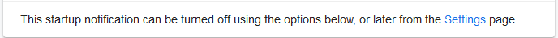

## O que é Yomichan e pra que serve?

Yomichan é um extenção código-aberto para navegadores baseados em Chromium ou no Firefox que permite você olhar o significado das palavras no dicionário local rapidamente apenas precionando ++shift++ em cima da palavra.

## Instalação

Primeiro baixe a versão compatível com seu navegador:

- [Chrome](https://chrome.google.com/webstore/detail/yomichan/ogmnaimimemjmbakcfefmnahgdfhfami)
- [Firefox](https://addons.mozilla.org/en-US/firefox/addon/yomichan/)

Após isso você será direcionado para uma página de boas vindas, então clique em ``Settings`` em baixo da página ou clique na extenção e depois na engrenagem.



Em seguida, desative a seguinte opção. Com isso desativado, sempre que for abrir o navegador, não será direcionado para as configurações da extenção.


## Dicionários

A extenção ainda não está funcionando, pois ela não possui nenhum dicionário. Para isso você deve baixar um(ou vários se quiser). Aqui o passo-a-passo do que se fazer:

1. Escolha um ou mais dicionários nesse [link](https://drive.google.com/drive/folders/1waPgFWM38hHop9Y6cNPhMeWd4fNS2mKv?usp=sharing) 

!!! note "Dicionários"
    1. Os arquivos que começam com``[Freq]`` são para mostrar o quão frequente é uma palavra na Wikipedia, animes, VNs... Começando do 1 como a mais frequente e aumentando até a   menos frequente. São ótimos caso você apenas queira decorar as palavras mais comuns.
    1. ``[Grammar]`` é referente ao(s) dicionário(s) de gramática.
    1. ``kireicake`` e ``jmdict_english`` são dicionários de japonês para inglês.
    1. (Extra) Tem um dicionário japonês para português traduzido pelo Deepl [aqui](https://github.com/eyeS-Code/jmdict_portuguese).
    1. ``kanjidic_english`` é um dicionário de Kanji de japonês para inglês.
    1. ``JMnedict`` é um dicionários de nome


!!! tip "Dicionários que eu uso"
    ``kireicake``, ``jmdict_english`` e ``kanjidic_english`` todos de frequência.


1. Vá na aba ``Dictionaries`` no Yomichan e clique ``Configure installed and enabled dictionaries`` e depois em ```import```.
1. Coloque todos os dicionários que baixou e aguarde uns minutinhos.
1. Vá testando os dicionários 

Pronto! Agora é só apertar ++shift++ e terá o significado da palavra.


